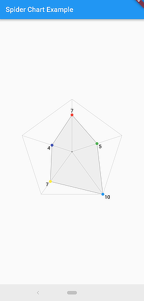

# spider_chart

A simple spider/radar chart library for Flutter.



## Quick Start

More examples will be added, but this will get you going in the meantime. The chart can be sized with a container or by passing in a `Size` object to the `size` named parameter.

```dart
Center(
  child: Container(
    width: 300,
    height: 300,
    child: SpiderChart(
      data: [
        7,
        5,
        10,
        7,
        4,
      ],
      maxValue: 10, // the maximum value that you want to represent (essentially sets the data scale of the chart)
      colors: <Color>[
        Colors.red,
        Colors.green,
        Colors.blue,
        Colors.yellow,
        Colors.indigo,
      ],
    ),
  ),
)
```

```dart
import 'package:carousel_slider/carousel_slider.dart';
import 'package:flutter/material.dart';
import 'package:spider_chart/spider_chart.dart';

class SpiderChartWithIndicatorText extends StatefulWidget {
  const SpiderChartWithIndicatorText({
    Key? key,
    this.width,
    this.height,
    this.data,
    this.data2,
    this.data3,
    this.data4,
    this.dataName,
    this.data2Name,
    this.data3Name,
    this.data4Name,
  }) : super(key: key);

  final double? width;
  final double? height;
  final List<double>? data;
  final List<double>? data2;
  final List<double>? data3;
  final List<double>? data4;
  final String? dataName;
  final String? data2Name;
  final String? data3Name;
  final String? data4Name;

  @override
  State<SpiderChartWithIndicatorText> createState() =>
      _SpiderChartWithIndicatorTextState();
}

class _SpiderChartWithIndicatorTextState
    extends State<SpiderChartWithIndicatorText> {
  List<SpiderChart> list = [];
  int _current = 0;
  final CarouselController _controller = CarouselController();
  final colorList = [
    const Color(0xff62ACD6),
    const Color(0xffE69138),
    const Color(0xff4EA8A8),
    const Color(0xff38761D),
    const Color(0xff6499E8),
  ];
  List<String> names = [
    'Performance',
    'Power',
    'Quality',
    'Service',
    'Cost',
  ];

  @override
  void initState() {
    // TODO: implement initState
    super.initState();
    get();
  }

  get() {
    print('Data :${widget.data}');
    print('name :${widget.dataName}');

    if (widget.data != null && widget.data!.length == 5) {
      list.add(SpiderChart(
        data: widget.data!,
        colorSwatch: Colors.blue,
        labels: names,
        lineColor: Colors.blueAccent,
        maxValue: 10,
      ));
    }
    if (widget.data2 != null && widget.data2!.length == 5) {
      list.add(SpiderChart(
        data: widget.data2!,
        colorSwatch: Colors.orange,
        labels: names,
        maxValue: 10,
        lineColor: Colors.orangeAccent,
      ));
    }
    if (widget.data3 != null && widget.data3!.length == 5) {
      list.add(SpiderChart(
        data: widget.data3!,
        colorSwatch: Colors.deepPurple,
        labels: names,
        maxValue: 10,
        lineColor: Colors.deepPurpleAccent,
      ));
    }
    if (widget.data4 != null && widget.data4!.length == 5) {
      list.add(SpiderChart(
        data: widget.data4!,
        colorSwatch: Colors.green,
        labels: names,
        lineColor: Colors.greenAccent,
        maxValue: 10,
      ));
    }

    print(list);
  }

  getTextName(int index) {
    switch (index) {
      case 0:
        return widget.dataName ?? '';

      case 1:
        return widget.data2Name ?? '';

      case 2:
        return widget.data3Name ?? '';

      case 3:
        return widget.data4Name ?? '';

      default:
        return '';
    }
  }

  @override
  Widget build(BuildContext context) {
    return Scaffold(
      backgroundColor: Colors.white,
      appBar: AppBar(
        title: const Text(
          'Spider',
          style: TextStyle(color: Colors.white),
        ),
        backgroundColor: Colors.blue,
      ),
      body: Column(
        children: [
          CarouselSlider(
            carouselController: _controller,
            options: CarouselOptions(
              pageSnapping: true,
              autoPlay: true,
              enlargeCenterPage: true,
              aspectRatio: 2.0,
              onPageChanged: (index, reason) {
                setState(() {
                  _current = index;
                });
              },
              height: widget.height ??
                  MediaQuery.of(context).size.longestSide * 0.4,
            ),
            items: list.map((i) {
              return Builder(
                builder: (BuildContext context) {
                  return Container(
                      width: widget.width,
                      margin: const EdgeInsets.symmetric(horizontal: 5.0),
                      decoration: const BoxDecoration(
                          borderRadius: BorderRadius.all(Radius.circular(20))),
                      child: Padding(
                        padding: EdgeInsets.symmetric(
                            vertical:
                                MediaQuery.of(context).size.shortestSide * 0.1),
                        child: i,
                      ));
                },
              );
            }).toList(),
          ),
          Text(
            getTextName(_current),
            style: TextStyle(
                fontSize: MediaQuery.of(context).size.shortestSide * 0.05,
                fontWeight: FontWeight.w600),
          ),
          Row(
              mainAxisAlignment: MainAxisAlignment.center,
              children: List.generate(
                  list.length,
                  (index) => GestureDetector(
                        onTap: () {
                          print(index);
                          _controller.animateToPage(index);
                        },
                        child: Container(
                          width: 12.0,
                          height: 12.0,
                          margin: const EdgeInsets.symmetric(
                              vertical: 8.0, horizontal: 4.0),
                          decoration: BoxDecoration(
                              shape: BoxShape.circle,
                              color: (Theme.of(context).brightness ==
                                          Brightness.dark
                                      ? Colors.white
                                      : Colors.black)
                                  .withOpacity(_current == index ? 0.9 : 0.4)),
                        ),
                      ))),
        ],
      ),
    );
  }
}

```
